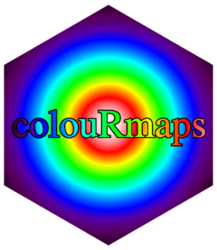

<!-- README.md is generated from README.Rmd. Please edit that file -->

```{r, include = FALSE}
knitr::opts_chunk$set(
  collapse = TRUE,
  comment = "#>",
  fig.path = "man/figures/README-",
  out.width = "100%",
  cache=T
)
```

# colouRmaps 

<!-- badges: start -->
<!-- badges: end -->

The goal of colouRmaps is to provide additonal colour maps or palettes for R graphics, and for easy use alongside ggplot.

## Installation

You can install the development version of colouRmaps from [GitHub](https://github.com/paul-goodall/colouRmaps) with:

``` r
# install.packages("devtools")
devtools::install_github("paul-goodall/colouRmaps")
```

## Existing ColouRmaps

Gettings started - view the available colouRmaps with:

```{r show_cmap_names}
library(colouRmaps)

cmap_names()

```

You can view the colour bars for the colouRmaps like so:

```{r cmap_show_all, eval=F}
cmap_show_all()
```


Alternatively, you can have a sneak-peak under the hood at a particular colourmap in more detail:

```{r cmap_show_one}
p1 <- cmap_show("rgb_harmonics")
p2 <- cmap_show("great_barrier_reef")

library(gridExtra)
grid.arrange(p1,p2, nrow=1,ncol=2)
```

## Defining new ColouRmaps

`rgb_harmonics` is a fun one, because it allows you to create a palette from the superposition of R,G and B cosines.  You can make some very weird and wacky colour-palettes this way, but mostly they are non-intuitive and ugly unless you're careful about choosing your boundary conditions.  Smoothly-changing and continuous ColouRmaps are best for most purposes, but you can of course create some ColourMaps that are discrete (suchs as `aips0`), or discontinuous (such as `backgr`), depending on your purposes.

### A smooth ColouRmap example:

```{r cmap_new_smooth}

# Create a new colouRmap definition:
colouRmaps$define_map$new_palette1 <- function(z0, normalise=T, output_mode=1){
  
  freq_r=0.5
  phase_r=0
  
  freq_g=1
  phase_g=0
  
  freq_b=0.5
  phase_b=pi
  
  colouRmaps$define_map$rgb_harmonics(z0=z0, 
                                      normalise=normalise, 
                                      output_mode=output_mode,
                                      freq_r=freq_r, phase_r=phase_r,
                                      freq_g=freq_g, phase_g=phase_g,
                                      freq_b=freq_b, phase_b=phase_b
                                      )
}

cmap_show("new_palette1")
```

### A stripey ColouRmap example:

```{r cmap_new_stripey}
colouRmaps$define_map$new_palette2 <- function(z0, normalise=T, output_mode=1){
  
  freq_r=0.5
  phase_r=0
  
  freq_g=0.5
  phase_g=pi
  
  freq_b=10
  phase_b=0
  
  freq_r=0.5
  phase_r=0
  
  freq_g=10
  phase_g=0
  
  freq_b=0.5
  phase_b=pi
  
  colouRmaps$define_map$rgb_harmonics(z0=z0, 
                                      normalise=normalise, 
                                      output_mode=output_mode,
                                      freq_r=freq_r, phase_r=phase_r,
                                      freq_g=freq_g, phase_g=phase_g,
                                      freq_b=freq_b, phase_b=phase_b
                                      )
}

cmap_show("new_palette2")
```


## Continous Colour Mapping

We can use `colouRise` to change the continuous colour mapping for ggplots.  This is just a wrapper for `ggplot2::continuous_scale` to allow a neater calling for `colouRmaps::cmap_continuous`:

```{r hexbin_example}
library(colouRmaps)
library(ggplot2)

p1 <- ggplot(diamonds, aes(carat, price)) + 
  geom_hex(binwidth = c(.1, 500))

p2 <- p1 + colouRise("gle_redblue", aesthetics = "fill")

p3 <- p1 + colouRise("gle_redblue", aesthetics = "fill", trans="sqrt")

p4 <- p1 + colouRise("gle_redblue", aesthetics = "fill", trans="log10")

library(gridExtra)
grid.arrange(p1,p2,p3,p4, nrow=2,ncol=2)

```


A scatterplot example:

```{r scatterplot_example_prelims, echo=T, warning=F, message=F}
library(colouRmaps)
library(ggplot2)
library(dplyr)
```

```{r scatterplot_example}
df <- diamonds %>% mutate('approx_volume'= (4/3)*pi*((x+y+z)/6)^3,
        'price_per_carat'=price/carat,
        'price_density'=price/approx_volume)
ii <- which(df$approx_volume == 0)
df$price_density[ii] <- NA

df <- df %>% filter(approx_volume < 1000, price_density < 200)

p1 <- ggplot(df, aes(approx_volume, price, color=price_per_carat)) + geom_point()
p1

p1 + colouRise("blue_purple_red4", aesthetics = "color")

p2 <- ggplot(df, aes(approx_volume, carat)) + geom_point(aes(color=price_density))
p2 + colouRise("roygbiv4", aesthetics = "color")


```

## Image examples

```{r image_example}
# Adapted from graphics::image example:

x <- 10*(1:nrow(volcano))
y <- 10*(1:ncol(volcano))
image(x, y, volcano, col = cmap_create("great_barrier_reef"), axes = FALSE)
axis(1, at = seq(100, 800, by = 100))
axis(2, at = seq(100, 600, by = 100))
box()
title(main = "Maunga Whau Volcano", font.main = 4, sub="ColouRed using cmap='great_barrier_reef'")

```

```{r image_example2}
# Adapted from graphics::image example:

x <- 10*(1:nrow(volcano))
y <- 10*(1:ncol(volcano))
image(x, y, volcano, col = cmap_create("new_palette1"), axes = FALSE)
axis(1, at = seq(100, 800, by = 100))
axis(2, at = seq(100, 600, by = 100))
box()
title(main = "Maunga Whau Volcano", font.main = 4, sub="The smooth 'new_palette1' is OK for images (but not amazing)")

```


```{r image_example3}
# Adapted from graphics::image example:

x <- 10*(1:nrow(volcano))
y <- 10*(1:ncol(volcano))
image(x, y, volcano, col = cmap_create("new_palette2"), axes = FALSE)
axis(1, at = seq(100, 800, by = 100))
axis(2, at = seq(100, 600, by = 100))
box()
title(main = "Maunga Whau Volcano", font.main = 4, sub="The stripey 'new_palette2' is awful for images (use contours instead)")

```

```{r image_example4}
# Adapted from graphics::image example:

x <- 10*(1:nrow(volcano))
y <- 10*(1:ncol(volcano))
image(x, y, volcano, col = cmap_create("paints2"), axes = FALSE)
axis(1, at = seq(100, 800, by = 100))
axis(2, at = seq(100, 600, by = 100))
box()
title(main = "Maunga Whau Volcano", font.main = 4, sub="Paint-by-numbers")

```


```{r image_example5}
# Adapted from graphics::image example:

x <- 10*(1:nrow(volcano))
y <- 10*(1:ncol(volcano))
image(x, y, volcano, col = cmap_create("aips0"), axes = FALSE)
axis(1, at = seq(100, 800, by = 100))
axis(2, at = seq(100, 600, by = 100))
box()
title(main = "Maunga Whau Volcano", font.main = 4, sub="'My Tower of Hanoi Melted!' - by Paul Goodall")

```
